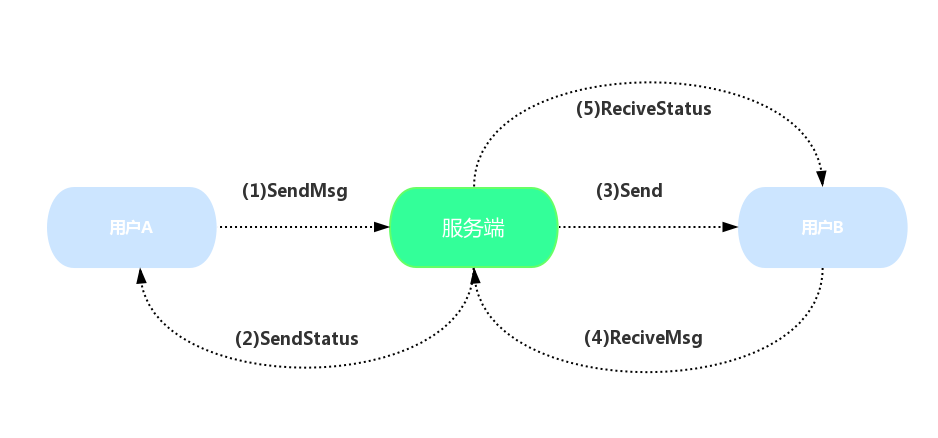

# websocket 点对点通讯协议

websocket 不同于http, 前者更为底层,即使使用子协议stomp,还是不能满足点对点通讯需求,所以自定义了一个聊天通讯协议

能力浅薄,客户端示例代码只有js实现,安卓大胸弟要自力更生了`(=ↀωↀ=)"`

[JS-Stomp Over Websocket文档](https://segmentfault.com/a/1190000006617344)

### 点对点聊天流程:
唔...差不多如图

### 建立websocket通讯通道:

- websocket服务器地址:
  
  1.SockJS连接:`应用地址 + "/socketServer?srect=" + {用户登录获取的token}` 
  2.普通连接:`应用地址中+ "/client?srect=" + {用户登录获取的token}`
	

  前端(SockJS连接)示例:
  		
		
		sock = new SockJS("http://127.0.0.1:8080/Mimi/socketServer?srect=" + srect);
		stomp = Stomp.over(sock); // 使用stomp协议

### 消息订阅通道:
	
- 订阅用户的聊天消息:
在此端点接收该用户收到的聊天信息(Send):
 
		stomp.subscribe(
			"/user/"+{uname}+"/recive", //或者 "/user/"+{uid}+"/recive"
			function (message) {
						console.info("message: "+ message);
						var chatMsg = JSON.parse(message.body);
						reciveMsg(chatMsg.chatID);
				});

  message格式:

		{
			"id":255,
			"chatID":"34330e6e473c583354421ef814bcea13022d8a06",
			"sender":"wususu",
			"reciver":"liaojiekx",
			"content":"起来聊天",
			"time":1504712402000,
			"senderId":1,
			"reciverId":2
		}

- 订阅用户的错误通知:
  
 		stomp.subscribe(
			"/user/queue/status", 
			function (message) {
						console.info("exception: "+ message);
				});

- 订阅聊天消息发送状态通知(SendStatus):
成功发送消息后会在此端点接收到来自服务器的推送:

  		stomp.subscribe("/user/queue/send/status", 
			function (message) {
						console.info("send status: "+ message);
				});	
  message格式:
	
		{
			"msgID":"34330e6e473c583354421ef814bcea13022d8a06",
			"code":200,
			"status":"成功",
			"content":"(=ↀωↀ=)"
		}

- 订阅聊天消息确认接收状态通知(ReciveStatus):
成功发送确认接收消息后会在此端点接收到来自服务器的推送:

  		stomp.subscribe("/user/queue/recive/status",
			function (message) {
						console.info("recive status: "+ message);
				});

  message格式:

		{
			"msgID":"34330e6e473c583354421ef814bcea13022d8a06",
			"code":200,
			"status":"成功",
			"content":"(=ↀωↀ=)"
		}
	

### 消息发送通道:

- 向服务端推送要发送的聊天消息(SendMsg):
`消息发送对象`: 

		{
			    "msgID":  此条消息的唯一序列码
			"reciverId":  接收消息用户的 UID
			  "content":  聊天信息
		}

用户每发出一条聊天信息, 除了必要的消息条目, 还要加上一个唯一序列码,用于后续的消息发送情况定位. 
序列码采用SHA1的加密方式生成: 

`唯一序列码 = SHA1(发送的主题内容 + 当前日期(毫秒数))  `
	
前端代码示例:
  
		var SHA1 = new Hashes.SHA1;
		var  data = {
				'reciverId':2,
				'content':'聊天内容'
			}
		var srect  = SHA1.hex(data+ (new Date()).getTime(););
		data.msgID = srect;	
		//data = {reciverId: 2, content: "聊天内容", msgID: 	"edb1ca1101d9f3406e7e269c9a3d4fe0034ca48b"}			
		stomp.send(
				"/socket/chat/send",
				{},
				JSON.stringify(data)
			);

- 向服务端推送已经接收聊天消息的确认消息(ReciveMsg):
成功接收消息后要推送以确认接收

		stomp.send(
			"/socket/chat/recive",
			{},
			JSON.stringify({
	                		'msgID'chatId
	                		  })
			);

- 要求服务端推送连接用户未接收到的消息(Init):
初始化操作,建立socket连接之后发送此初始化信息,获取还未接收的聊天消息

			stomp.send
			(
			"/socket/chat/init",
			{}, 
			null
			);

